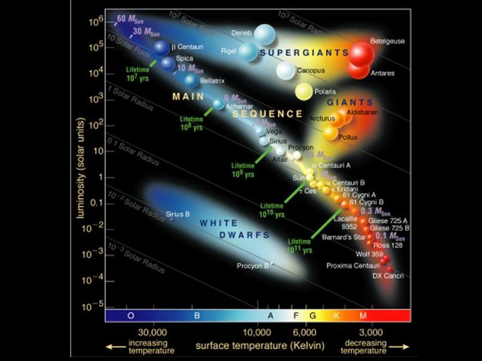

# Star-Type-Prediction-With-Scikit-Learn-Random-Forest-Classifier

## 📡 Project Abstract
This project implements a random forest classifier to predict the spectral classification of stars based on their observed attributes. 

## 🧮 Model

## ⭐ Dataset

This project utilizes a six-class dataset, which articulates various star attributes that the application later extrapolates to use as training features for the random forest.

See: https://www.kaggle.com/datasets/deepu1109/star-dataset/data

## 📏 Specs

Languages:

## 🖥️ Usage

