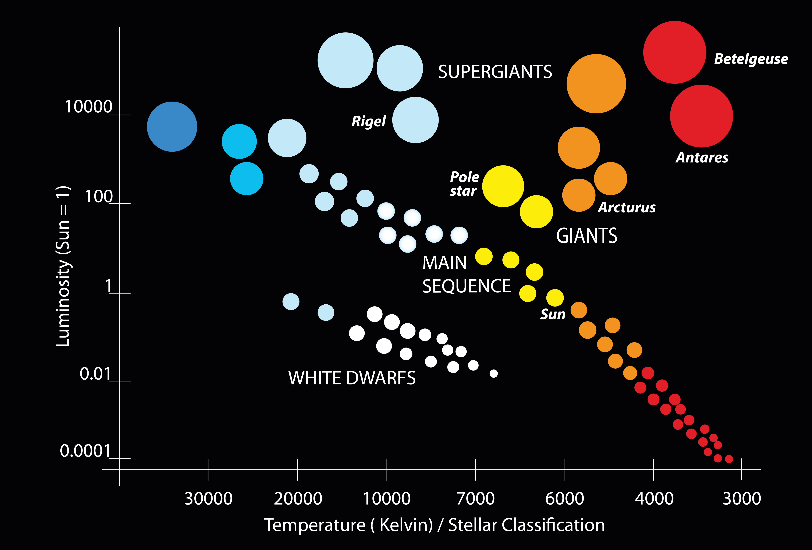
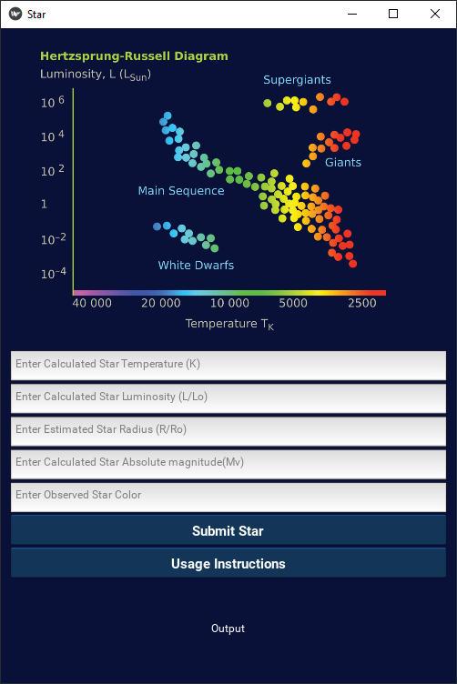

# STARWATCH: 

Star Type Prediction With Scikit Learn Random Forest Classifier



## 📡 Project Abstract
This project implements a random forest classifier to predict the spectral classification of stars based on their observed attributes, as on the HR Diagram.

**What is the HR Diagram?**

The Hertzsprung–Russell (HR) diagram is a fundamental tool in astronomy used to understand and classify stars based on their luminosity (intrinsic brightness) and surface temperature (or spectral type/color). On the diagram, stars are plotted with luminosity or absolute magnitude on the vertical axis and surface temperature on the horizontal axis, which decreases from left (hot, blue stars) to right (cool, red stars).

**What are the features we're talking about?**

The standard mathematical representations for the features in the dataset utilized in this project are:

**Temperature (K)**  

$\displaystyle{T = \left( \frac{L}{4\pi R^2 \sigma} \right)^{1/4}}$

**Luminosity**  

$L = 4\pi R^2 \sigma T^4$

**Absolute Magnitude**  

$M = -2.5 \log_{10} \left( \frac{L}{L_\odot} \right) + M_\odot$


## 🧮 Model

### Random Forest Classifier

The Random Forest Classifier is an ensemble machine learning algorithm that builds a multitude of decision trees during training and outputs the class that is the mode (most frequent) of the individual trees' predictions. Each tree is trained on a randomly selected subset of the training data using a technique called bootstrap aggregation (bagging), and at each node split, only a random subset of features is considered. This randomness helps reduce the chance of overfitting, which is a common issue with single decision trees, while improving the model's accuracy and generalization capabilities.

One of the key strengths of a Random Forest is its robustness—it handles both numerical and categorical data well, can manage missing values, and is relatively resistant to noisy data or overfitting, especially with enough trees. Additionally, it provides useful insights like feature importance (which features heavily in this project) which helps identify which features have the most predictive power. Though Random Forests can be computationally intensive and less interpretable than simpler models, they are widely used due to their strong performance across a variety of classification problems.


## ⭐ Dataset

This project utilizes a six-class dataset, which articulates various star attributes that the application later extrapolates to use as training features for the random forest.

These features are as follows:

```
- Absolute Temperature (in K)
- Relative Luminosity (L/Lo)
- Relative Radius (R/Ro)
- Absolute Magnitude (Mv)
- Star Color (white,Red,Blue,Yellow,yellow-orange etc)
- Spectral Class (O,B,A,F,G,K,,M)
- Star Type (Red Dwarf, Brown Dwarf, White Dwarf, Main Sequence , SuperGiants, HyperGiants)
- Lo = 3.828 x 10^26 Watts (Avg Luminosity of Sun)
- Ro = 6.9551 x 10^8 m (Avg Radius of Sun)
```

See: https://www.kaggle.com/datasets/deepu1109/star-dataset/data

## 📏 Requirements 

**Core Scientific Libraries:**
 ```
numpy
pandas
matplotlib
seaborn
```
 **Machine Learning:**
```
scikit-learn
```    
**Kivy GUI Framework**
```
kivy[base] or kivy[full]
```
## 🖥️ Usage
Install application requirements:
```
pip install -r requirements.txt
```
Then run main.py

```
python3 main.py
```
First, you will be presented with a confusion matrix demonstrating the training results for the random forest classifier. The x-axis represents predicted labels, and the y-axis represents true labels.


Next, you will get a bar-chart of feature importance, indicating which features were the most important for training.


Lastly, you will be presented with the GUI. Please select "Usage Instructions" to see how to fill out the form.



